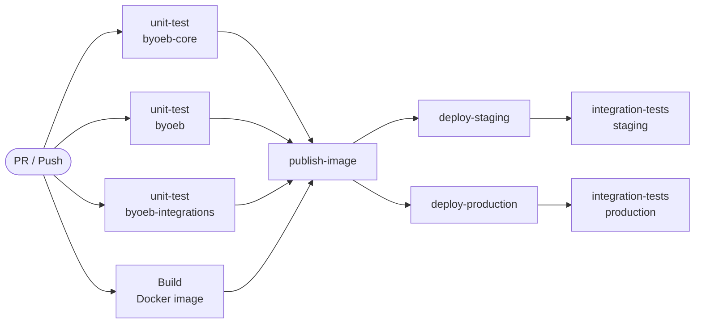
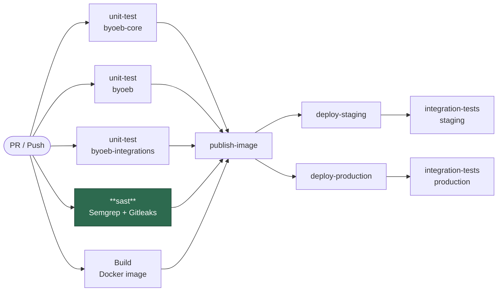
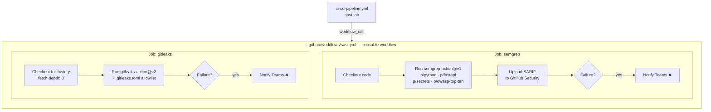
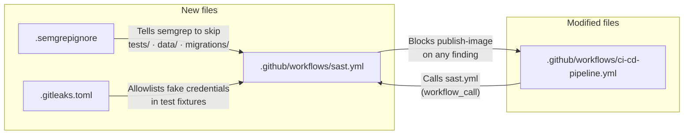
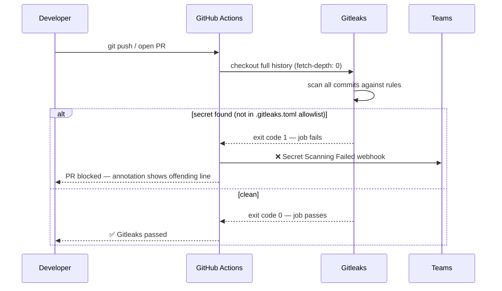
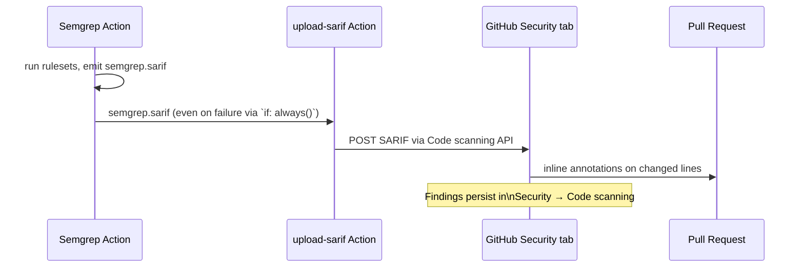
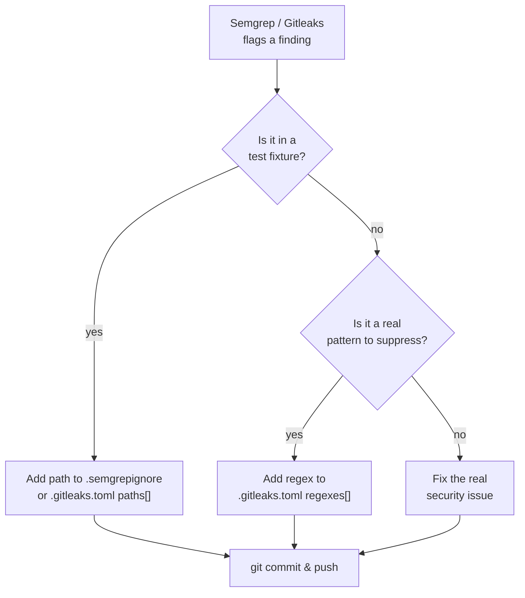

# SAST & Secret Scanning — Architecture

## What We're Adding

No static security analysis or secret-leak detection exists in the pipeline today.
This change adds two scanners that run **in parallel with unit tests** on every PR and push:

| Scanner | What it catches |
|---------|----------------|
| **Semgrep** | Python/FastAPI vulnerabilities, OWASP Top 10, hardcoded secrets patterns |
| **Gitleaks** | Actual secrets (API keys, tokens) committed anywhere in git history |

Results block the pipeline. SARIF output appears as inline PR annotations in GitHub Security → Code scanning.

---

## Current Pipeline (before)

---

## New Pipeline (after)

> `publish-image` now waits on **five** jobs instead of four. SAST blocks the image from ever reaching the registry if findings exist.

---

## SAST Workflow Internal Structure

---

## What Each New File Does

---

## Secret Detection Flow (Gitleaks)

---

## SARIF Upload Flow (Semgrep → GitHub Security)

---

## False-Positive Suppression Strategy

---

## Required Secrets / Variables

| Name | Where | Required? | Purpose |
|------|-------|-----------|---------|
| `SEMGREP_APP_TOKEN` | GitHub repo secrets | **Optional** | Enables Semgrep Cloud dashboard; OSS rules work without it |
| `TEAMS_WEBHOOK_URL` | GitHub repo secrets | Optional (already present) | Failure notifications |
| `GITHUB_TOKEN` | Auto-provided | Automatic | Gitleaks auth + SARIF upload |

---

## Acceptance Criteria Checklist

- [ ] Semgrep findings fail the PR; results visible in GitHub Security → Code scanning
- [ ] Gitleaks always blocks on detected secrets
- [ ] No false positives from test fixtures (`.gitleaks.toml` + `.semgrepignore` tuned)
- [ ] SARIF uploaded — findings appear as inline PR annotations
- [ ] `SEMGREP_APP_TOKEN` optional — pipeline works without it (uses OSS rules)
